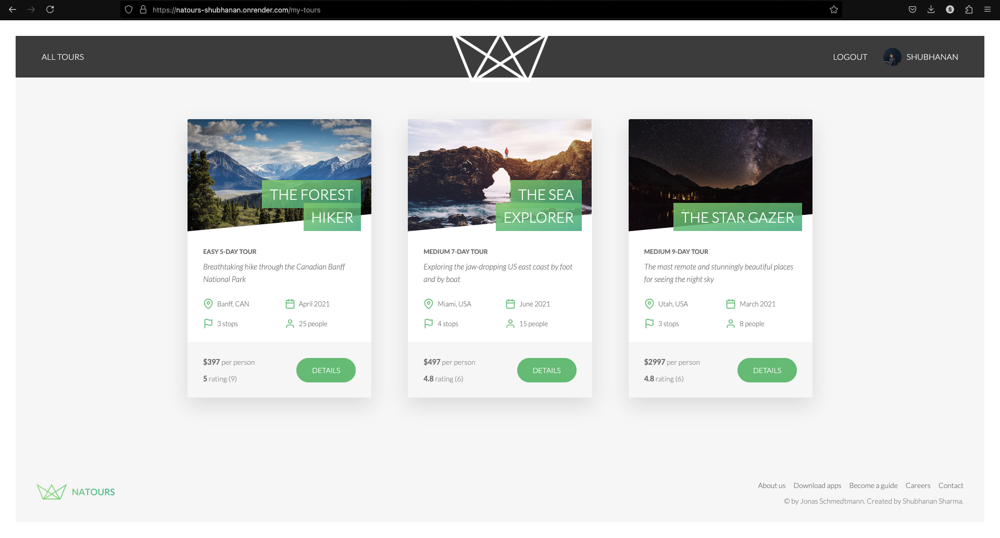

# Natours - Tour Booking API

<p align="center">
  <a href="https://natours-shubhanan.onrender.com/">
    
  </a>
</p>

<h1 align="center">
  <br>
  
  <br>
  Natours
  <br>
</h1>

<h4 align="center">A dynamic tour booking platform built with NodeJS, Express, and MongoDB.</h4>

## Live Demo

Experience Natours live: [Natours Live Demo](https://natours-shubhanan.onrender.com/)

## Key Features

- **User Authentication:** Secure login/signup using JWT.
- **Role-based Access Control:** Different roles for Admin, User, and Guide.
- **Tour Management:** Create, update, delete, and list tours.
- **Advanced Querying:** Filtering, sorting, and pagination of tours.
- **Booking System:** Secure bookings and payment integration.
- **Robust Security:** Helmet, data sanitization, rate limiting, and CORS.
- **Responsive API:** Fast and efficient API endpoints.

## Preview

### Login Screen


### Homepage


### Tour Details


### Payment Gateway


### Bookings



### User Dashboard


## Tech Stack

- **Backend:** Node.js, Express.js
- **Database:** MongoDB, Mongoose
- **Templating Engine:** Pug
- **Bundler:** Parcel
- **Authentication:** JSON Web Tokens (JWT), bcrypt
- **Security:** Helmet, CORS, Express-rate-limit
- **Payment Integration:** Stripe
- **Other Tools:**
  - **Mailtrap:** For email testing
  - **SendGrid:** For email delivery
  - **Leaflet:** For interactive maps
  - **Postman:** For API testing
  - **Render:** For Deployment

## How to Use

### Booking a Tour

1. Create an account or login (username: john@example.com, password: test1234)
2. Browse available tours
3. Select a tour and click "Book Tour"
4. Complete payment with test credit card:
   ```
   Card Number: 4242 4242 4242 4242
   Expiry Date: Any future date (MM/YY)
   CVC: Any 3 digits
   ```
5. View your booked tour in your user dashboard

### Managing Your Account

- Update your profile picture, name, and email
- Change your password
- View your booked tours

## Installation

1. **Clone the Repository:**

   ```sh
   git clone https://github.com/yourusername/Natours.git
   cd Natours
   ```

2. **Install Dependencies:**

   ```sh
   npm install
   ```

3. **Set up Environment Variables:**

   - Copy `sampleConfig.env` to `config.env` and configure it with your settings.

4. **Run the Application:**

   ```sh
   npm run dev
   ```

   **For production:**

   ```
    npm run build:js
    npm run start:prod
   ```

## API Usage

The Natours API provides programmatic access to tours, users, reviews, and bookings.

### Key Endpoints

```
GET /api/v1/tours - List all tours
GET /api/v1/tours/:id - Get specific tour
GET /api/v1/tours/top-5-cheap - Top 5 affordable tours
GET /api/v1/tours/tours-within/:distance/center/:latlng/unit/:unit - Find tours within radius
POST /api/v1/users/signup - Create new user
POST /api/v1/users/login - Login user
```

For complete API documentation, visit: [Natours API Documentation](https://documenter.getpostman.com/view/41999888/2sAYdeNY3G)

## Future Enhancements

- **User Reviews & Ratings:** Allow users to leave feedback on tours.
- **Dark Mode:** Allow users choose between light and dark mode.
- **Enhanced Payment Integration:** Expand support for more payment gateways.
- **Real-Time Notifications:** Integrate WebSocket for real-time updates.
- **Mobile App Integration:** Build a companion mobile app.

## Acknowledgments

- This project is inspired by Jonas Schmedtmann’s Udemy course - Node.js, Express, MongoDB & More: The Complete Bootcamp.
- Logo and design elements from the original course materials.

## License

This project is licensed under the MIT License.

---

Feel free to modify and enhance this project as needed!
